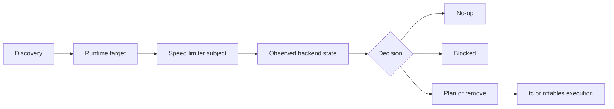

# Diagrams

This section is the visual foundation for RayLimit documentation.

Use it for diagrams that explain the product model, runtime targeting, reconcile behavior, and the concrete versus blocked execution boundaries of the speed limiter families.

## Mermaid Foundation

The docs site is prepared for Mermaid-based diagrams so visual explanations can live next to the pages they support instead of being managed separately.

Use standard Markdown Mermaid fences in documentation pages:

````md

````

The site converts those blocks into rendered Mermaid diagrams at runtime.

## System Model



## Current Diagram Themes

- operator flow from discovery to execute
- speed limiter family scope and backend model
- UUID concrete and blocked execution paths
- deeper reconcile and observed-state diagrams as the technical pages grow

Keep diagrams close to the page or topic they explain so the narrative and visual model stay aligned.
