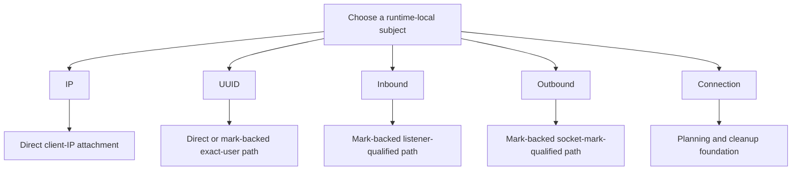

# Speed Limiter Families

A speed limiter family defines the identity RayLimit uses to select traffic for shaping.

Some families are packet-facing and direct. Others depend on runtime evidence or mark-backed attachment paths. That is why the product truth differs by family.

## Choose The Right Speed Limiter

| Speed limiter family | Selects traffic by | Best fit | Current execution truth |
| --- | --- | --- | --- |
| [IP](ip.md) | visible client IP | one address is the correct shaping identity | concrete |
| [UUID](uuid.md) | runtime-local UUID membership | one user identity should share one pool across live sessions | concrete in the current safe evidence scopes |
| [Inbound](inbound.md) | inbound tag | one inbound listener path needs its own cap | concrete when one concrete TCP listener can be derived conservatively |
| [Outbound](outbound.md) | outbound tag | one egress path needs its own cap | concrete when one unique non-zero socket mark can be derived conservatively |
| [Connection](connection.md) | runtime-local connection identity | session-scoped planning or cleanup | not yet broadly developed as a concrete apply path |

## Product Truth By Family

The implemented speed limiter families are validated and actively developed. Their concrete execution scopes differ by the evidence RayLimit can prove on the host:

- IP is concrete because it can use a direct client-IP attachment path.
- UUID is the preferred identity-oriented path and is concrete only in the safe shared-pool scopes RayLimit can attach honestly today.
- Inbound and outbound are concrete only when their runtime-derived selectors are precise enough to support mark-backed classification.
- Connection has a real foundation, but broader concrete apply support is planned for future releases.

## Current Execution Model

## Direction Handling

Every speed limiter family uses the same `--direction upload|download` flag. RayLimit plans one direction at a time and applies the current family/backend rules to that side of the policy.

## Rule Selection And Precedence

When multiple rule kinds match the same live session, RayLimit uses one deterministic precedence order:

`connection > uuid > ip > inbound > outbound`

Within the winning precedence:

- exclude rules suppress limit rules
- multiple limit rules merge by taking the tightest per-direction value

This matters most when you combine direct user-oriented speed limiters such as UUID with broader operational speed limiters such as inbound or outbound.
