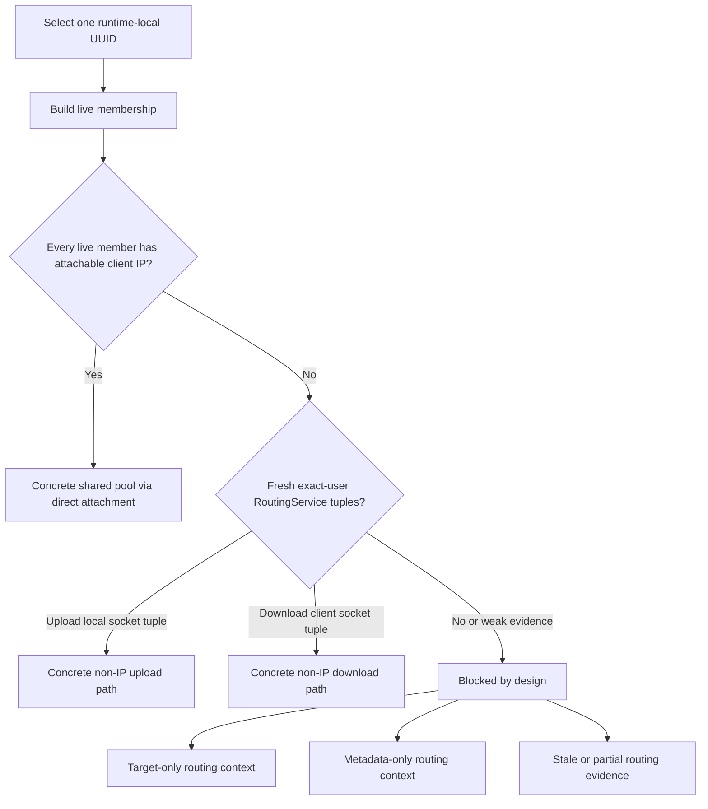

# UUID Speed Limiter

The UUID speed limiter is the preferred identity-oriented speed limiter in RayLimit.

Use it when the real subject is one user identity and that identity can span multiple live sessions on the same runtime.

## Product Model

Plain `--uuid` means one shared aggregate bandwidth pool per runtime-local UUID.

That model has two practical consequences:

- live sessions under the same UUID share one pool instead of receiving duplicated per-session caps
- zero live members is a safe no-op, not a hidden reservation of bandwidth

## What RayLimit Needs To Execute It

UUID execution is concrete only when RayLimit can attach the live membership honestly and exactly.

The currently safe concrete scopes are:

- attachable client-IP evidence for every live member
- fresh RoutingService-derived exact-user local socket tuples for the current upload classifier
- fresh RoutingService-derived exact-user client socket tuples for the current download classifier

## Current UUID Execution Model



## Practical Example

Preview the shared-pool result:

```bash
sudo raylimit limit --pid 1234 --uuid user-a --device eth0 --direction upload --rate 2048
```

The report should make these questions obvious:

- how many live members belong to the UUID
- whether the current attachment path is concrete
- what evidence is missing when execution is blocked

## Explicitly Blocked Scope

Execution remains blocked when evidence is stale, partial, unavailable, or still too weak to produce an exact-user-safe kernel-visible classifier.

That includes:

- target-only routing tuples
- metadata-only routing context such as tag, protocol, or domain
- live members missing both attachable client IPs and fresh exact-user socket tuples in the current safe scopes

## Why The Scope Is Narrow

UUID is intentionally strict because it is identity-oriented. RayLimit does not degrade UUID into a shared tunnel IP or another ambiguous network identity.

That is why blocked UUID execution is part of the product’s honesty model, not a missing error message.

## What To Expect In Practice

- If the shared pool is concrete, RayLimit can execute one runtime-local UUID class with the current safe attachment path.
- If the pool is not concrete, RayLimit tells you which evidence is available and which evidence is missing.
- Broader UUID attachment coverage is still planned for future releases, but the current scope remains exact-user-safe.
