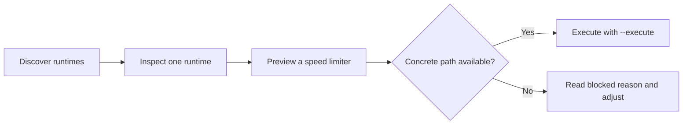

# RayLimit Documentation

RayLimit is a Linux CLI for discovering Xray runtimes, inspecting runtime state, and applying guarded speed limiters with dry-run-first workflows.

The implemented speed limiter families are validated and actively developed. Their concrete execution scopes differ by the quality of the runtime evidence and selectors available on the host.

Use the header language selector to move between English and Persian documentation.

## Browse By Need

The navigation is split into two main reading modes:

- operator guidance for installation, common commands, practical usage, troubleshooting, and validation
- deeper technical reference for architecture, internals, terminology, and diagrams

If you are starting from scratch, begin with the installation page in the sidebar and then continue into common commands and practical usage.

## Run Paths

RayLimit supports two practical entry paths:

- install from a release package for a normal host deployment
- run from source or a local build when you are evaluating, validating, or developing locally

## Operator Flow

## Current Product Scope

| Speed limiter family | Current release truth |
| --- | --- |
| IP | Validated and concrete for direct client-IP attachment, including the current native IPv6 scope |
| UUID | Validated and actively developed as the preferred identity-oriented speed limiter, with concrete shared-pool execution in the currently safe evidence scopes |
| Inbound | Validated and concrete when one concrete TCP listener can be derived conservatively |
| Outbound | Validated and concrete when one unique non-zero outbound socket mark can be derived conservatively |
| Connection | Foundational work is in place, and broader development is planned for future releases |

## Documentation Boundary

The repository `README.md` stays compact.
Detailed operator guidance and deep technical reference live here.
